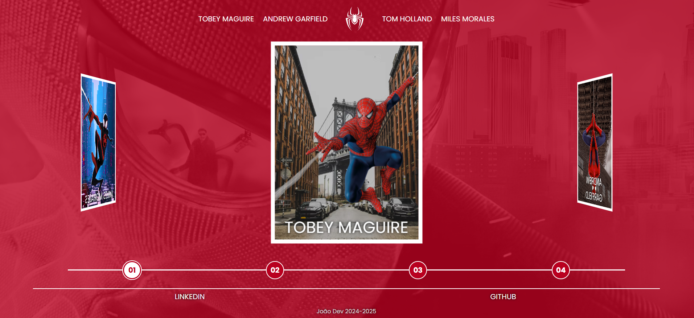

# 🕸️ Multiverso Spider-Man

Um site interativo inspirado no multiverso do Spider-Man, desenvolvido com **HTML**, **CSS** e **JavaScript**. O projeto apresenta um carrossel animado com diferentes versões do herói e páginas dedicadas a cada filme, trazendo informações e galerias temáticas.

## 🚀 Funcionalidades

* **Carrossel animado** com:

  * Spider-Man (Tobey Maguire) 🕷️
  * Spider-Man (Andrew Garfield) 🕷️
  * Spider-Man (Tom Holland) 🕷️
  * Spider-Man (Miles Morales - animação) 🕷️

* **Navegação intuitiva**:

  * Lista de nomes dos Spider-Mans acima do carrossel.
  * Botões para rotacionar o carrossel.
  * Seleção de Spider-Man clicando no card ou no nome.

* **Páginas individuais para cada filme**:

  * Sinopse do filme
  * Ano de lançamento
  * Diretor
  * Duração
  * Galeria de imagens com **Fancybox**

* **Menu lateral** para acessar facilmente todos os filmes de cada Spider-Man.

* **Animações e efeitos visuais** criados exclusivamente com **CSS**.

* **Design totalmente responsivo**, garantindo boa experiência em qualquer dispositivo.

## 🛠️ Tecnologias Utilizadas

* **HTML5** → Estrutura semântica do site
* **CSS3** → Estilização, responsividade e animações
* **JavaScript** → Lógica de navegação e integração da galeria
* **[Fancybox](https://fancyapps.com/fancybox/)** → Exibição das imagens da galeria

## 📸 Demonstração

## 📱 Responsividade

O projeto foi desenvolvido com o conceito **mobile-first**, garantindo uma navegação fluida em smartphones, tablets e desktops.

## 🎯 Objetivo

Esse projeto foi criado como forma de estudo e prática em **HTML, CSS e JavaScript**, com foco nos principais efeitos de CSS, explorando o máximo das animações, interatividade e organização de conteúdo de forma imersiva para o usuário.

## 🏆 Créditos

Este projeto foi desenvolvido como parte de um desafio educacional da [Digital Innovation One](https://web.digitalinnovation.one/).
